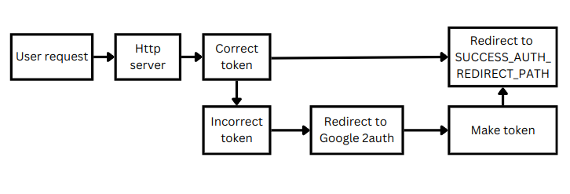
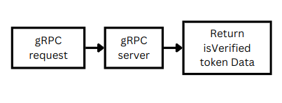

# gAuthCraft

gAuthCraft is a light microservice and flexible auth system for Google Oauth2 that works with gRPC and easily deploy with Docker and Jenkins.

- [gAuthCraft](#gauthcraft)
  - [How it works?](#how-it-works)
    - [How HTTP server works?](#how-http-server-works)
    - [How gRPC server works?](#how-grpc-server-works)
  - [Jenkins Pipeline for Node.js App with Docker](#jenkins-pipeline-for-nodejs-app-with-docker)
  - [Installation](#installation)
    - [First copy the repo](#first-copy-the-repo)
    - [Go to `gAuthCraft` direction and install deps](#go-to-gauthcraft-direction-and-install-deps)
    - [Make an `.env` file in `./config` direction and put your variables in it](#make-an-env-file-in-config-direction-and-put-your-variables-in-it)
    - [Commands](#commands)
  - [License](#license)

## How it works?

This is a solution for both http side and gRPC side requests. Http server will listen to requests from users to handle them auth and gRPC server will handle internal requests and only return token validation and decoded data. So you can handle auth with Google provider easily. Also you can connect any app with any language to the gRPC and use it.

### How HTTP server works?

1. User send HTTP request to HTTP server
2. HTTP server get the request and check the `gAuth` token
3. If token is correct redirect user to the `SUCCESS_AUTH_REDIRECT_PATH` that is in env file.
4. If token is incorrect/expired will delete the `gAuth` token, then redirect user to Google 2auth server. After auth in Google it will send a request to your server. Then it will make a new token for user and redirect user to the `SUCCESS_AUTH_REDIRECT_PATH`.
5. The server will save token as `gAuth` in cookies.
6. Default algorithm for signature is `HS256` but you can change it by passing algorithm to `tokenMaker` function.
7. This repo uses [linksmith](https://www.npmjs.com/package/linksmith) package to make URL easily.



### How gRPC server works?

gRPC server designed to work with application internal connection. You can connect it with any language based on `auth.proto` file and verify user token with it.



## Jenkins Pipeline for Node.js App with Docker

Jenkins pipeline automates the build, test, and deployment process of application using Docker Compose. It includes the following stages:

- **Build**: Builds the Docker images for all services defined in `docker-compose.yml`.
- **Run Tests**: Runs the test suite inside the `test` direction to verify the app's functionality.
- **Deploy**: Deploys the application by starting all services in detached mode.

This pipeline ensures smooth CI/CD by automating the entire flow from building to deploying the application.

## Installation

This repo use docker and Jenkins for deployment. So you have to have them in your system. For docker installation use this: [Docker installation](https://docs.docker.com/engine/install/) and for Jenkins you can use this docs: [Jenkins on Docker](https://www.jenkins.io/doc/book/installing/docker/). I used docker for easy deployment and jenkins for testing and deployment control for further development.

### First copy the repo

```bash
git clone https://github.com/yahya-aghdam/gAuthCraft.git
```

### Go to `gAuthCraft` direction and install deps

```bash
npm i
```

### Make an `.env` file in `./config` direction and put your variables in it

You can get your Google API key from Google API & Service: [Google Oauth2](https://console.cloud.google.com/apis/dashboard)

```ini
# Main URL
MAIN_URL=http://localhost

# api PATH
API_PATH=/api/g_auth

HTTP_PORT=3000

# Proto
PROTO_URL=0.0.0.0
PROTO_PORT=50051

# JWT secret key. It's better to be safe random 256bit string
JWT_SECRET=your_secret_key
COOKIE_DOMAIN=localhost

# Google
GOOGLE_CLIENT_ID=your-google-client-id
GOOGLE_CLIENT_SECRET=your-google-cient-secret

# Redirect path
SUCCESS_AUTH_REDIRECT_PATH=http://localhost:3000/api/g_auth/successful_auth
```

### Commands

As you can see in `package.json` file you can use these commands for development, test or deployment in the app

```json
"scripts": {
    "dev": "nodemon src/index.ts",
    "test": "jest --verbose",
    "build": "rm -rf ./dist && tsc",
    "start": "npm run build && node dist/index.js",
    "makeProto": "protoc --plugin=protoc-gen-ts_proto=./node_modules/.bin/protoc-gen-ts_proto --ts_proto_out=. ./src/protos/auth.proto --ts_proto_opt=outputServices=grpc-js,esModuleInterop=true",
    "docker:dev": "docker compose -f docker-compose.dev.yml up",
    "docker:build": "docker compose up --build -d"
}
```

**Scripts explanation:**

- Run app without docker as development. It will refresh after any changes:

```bash
npm run dev
```

- Test app logic with `jest` based on files at `./test` direction:

```bash
npm test
```

- Build app locally without docker:
  
```bash
npm run build
```

- Run app locally without docker:

```bash
npm run start
```

- If you made any changes in `auth.proto` file you have to make new `auth.ts` file to handle and use it in `auth.service.proto.ts` file. So you have to have `protoc` in your system. To install Protocol Buffer Compiler on your system you can download last release and install it on your system: [Download last protoc release](https://github.com/protocolbuffers/protobuf/releases)

```bash
npm run makeProto
```

- If you want to develop app as docker container you can use this command to dockerize an run the app. You can see changes after any save without need to restart the app. If you close the command or terminal, app will be stop.

```bash
npm run docker:dev
```

- If you want to deploy app and run it in background.

```bash
npm run docker:build
```

## License

This project is licensed under the MIT License - see the [LICENSE](LICENSE) file for details.